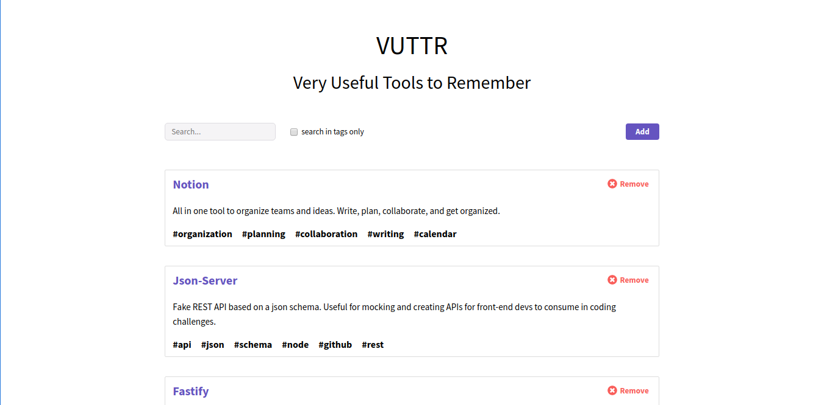

# Bossabox Site

Desafio da para desenvolvedor Front-End da @Bossabox ;)

## Como executar

Para executar o projeto, é necessário que você tenha a [API](https://gitlab.com/bossabox/challenge-fake-api) desenvolvida pela equipe ba bossabox instalada em sua máquina, rodando na porta `3000`. Então vai lá, baixe a API e siga todas as instruções para executá-la. Pronto! Agora que você tem a sua API rodando no seu `http://localhost:3000`, vamos seguir :)

Primeiro, faça o download desse repositório em sua máquina. Pode ser tanto por zip ou um git clone. Entre no diretório, e execute `yarn` para instalar as dependências do projeto. Caso esteja utilizando o npm, sem problemas, você pode executar `npm install`.

Para executar o site, execute `yarn start` ou `npm start`. Por padrão, o create-react-app irá tentar rodar a aplicação na porta 3000, mas como essa porta já está sendo usada pela api, ele irá perguntar se você deseja executar o site em outra porta disponível. Apenas aperte `y (yes)`.

## Arquitetura e Ferramentas

- [Redux](https://redux.js.org/) - Gerenciamento dos estados da aplicação
- [Styled-Components](https://www.styled-components.com/) - Lib para estilização de componentes. Utiliza o conceito de Css in Js.
- [Axios](https://github.com/axios/axios) - Cliente HTTP baseado no conceito de `promises`.
- [Redux-Saga](https://github.com/redux-saga/redux-saga) - Middleware para operações assíncronas dentro do redux.

Os componentes React são divididos em duas principais categoras. `Pages` e `Components`. Os componentes que estão no diretório `src/pages` são as páginas principais da aplicação, que são acessadas pela rota do navegador. Essas páginas são os componentes principais. Já dentro do diretório `src/components` estão componentes que podem ser reutilizados por toda a aplicação, e não estão amarrados a um escopo.

Toda a lógica do `redux` está no diretório `src/store`. Foi utulizada a arquitetura [ducks](https://github.com/erikras/ducks-modular-redux) para melhor organização.

## Layout

